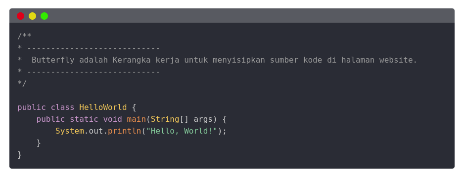

# Butterfly Template

- Butterfly Template adalah Kerangka kerja untuk menyisipkan sumber kode di halaman website, yang ringan, sederhana, dan mudah digunakan.

## Installation

### Dengan CDN:
- CSS
```html
<link rel="stylesheet" href="https://cdn.jsdelivr.net/gh/butterflytemplate/butterfly@master/css/style.css">
<link rel="stylesheet" href="https://cdn.jsdelivr.net/gh/butterflytemplate/butterfly@master/css/text_color.css">
```
- JS
```html
<script src="https://cdn.jsdelivr.net/gh/butterflytemplate/butterfly@master/js/text_color.js"></script>
```
## Penggunaan
- HTML
```html
<div class="container">
    <div class="header">
        <span class="red"></span>
        <span class="yellow"></span>
        <span class="green"></span>
    </div>
    <div class="body">
        <pre class="pre">
            <code class="language-java">
                /** 
                * ----------------------------
                *  Tempelkan Kode kamu disini
                * ----------------------------
                */
            </code>
        </pre>
    </div>
</div>
```

- Konfigurasi:
```html
<code class="language-java">
    //code
</code>
```
- Ubah menjadi:
```html
<code class="language-nama bahasa yang kamu gunakan">
    //code
</code>

//contoh

<code class="language-html">
    //code
</code>
<code class="language-css">
    //code
</code>
<code class="language-javascript">
    //code
</code>
<code class="language-php">
    //code
</code>
<code class="language-java">
    //code
</code>
<code class="language-python">
    //code
</code>
```

### Contoh Hasil:

